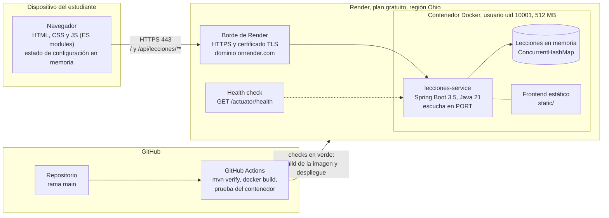
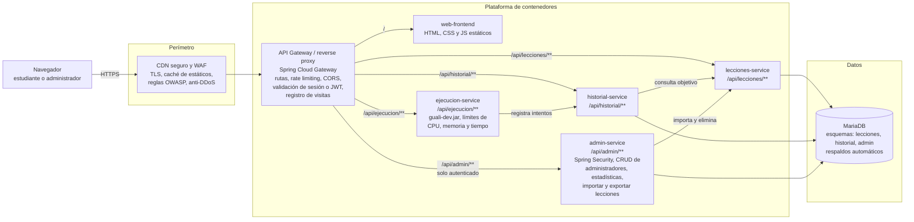

# Diagrama de despliegue

Dos vistas: lo que está desplegado hoy (fase 1) y la arquitectura objetivo de la fase 2, que agrega seguridad perimetral, API Gateway, microservicios y MariaDB.

## Fase 1 (actual)

| Nodo | Qué corre | Detalle |
|---|---|---|
| Navegador | Interfaz de práctica | Sin dependencias externas: fuentes, íconos y scripts vienen del servidor. Tamaño de letra y tema solo en memoria. |
| Borde de Render | Terminación TLS y enrutamiento | Render publica el servicio en `https://<servicio>.onrender.com` y reenvía al puerto `PORT` del contenedor. |
| Contenedor | `lecciones-service` (jar de Spring Boot sobre `eclipse-temurin:21-jre`) | Sirve la API REST y el frontend. Al arrancar carga las lecciones del classpath. |
| Health check | `GET /actuator/health` | Render no envía tráfico a una versión nueva hasta que responde `UP`. |
| GitHub Actions | Compilación, pruebas e imagen | Render despliega solo los commits cuyo CI pasó (`autoDeployTrigger: checksPass`). |

Limitaciones aceptadas en la fase 1: una sola instancia, el servicio se duerme tras 15 minutos sin tráfico, y los datos en memoria se reinician en cada despliegue (las lecciones de ejemplo se vuelven a cargar del classpath).

## Fase 2 (objetivo)

| Componente | Responsabilidad | Requisito del enunciado que cubre |
|---|---|---|
| CDN seguro + WAF | TLS, caché de archivos estáticos, filtro de ataques comunes y mitigación de denegación de servicio | Seguridad: WAF, anti-DoS, CDN seguro |
| API Gateway / reverse proxy | Único punto de entrada: enruta por prefijo, limita peticiones por IP, valida la sesión del administrador en `/api/admin/**` y registra cada visita | Seguridad: reverse proxy con seguridad integrada; estadísticas de visitas |
| `web-frontend` | Los mismos archivos de `static/` de la fase 1 | Interfaz gráfica |
| `lecciones-service` | El servicio de la fase 1 con `LeccionRepository` implementado sobre JPA | Lecciones en base de datos |
| `historial-service` | Sesiones de lección e intentos; decide si la sesión cumplió su objetivo | Panel Historial de Sesión |
| `ejecucion-service` | Compila y ejecuta con `guali-dev.jar`. Aislado y con límites de recursos, porque ejecuta código de terceros | Botones Compilar y Ejecutar |
| `admin-service` | Autenticación con Spring Security, CRUD de administradores, importar, exportar y eliminar lecciones, estadísticas | Administración del sistema |
| MariaDB | Persistencia, un esquema por servicio | Base de datos relacional MariaDB con JPA |

## Paso de la fase 1 a la fase 2

1. Implementar `JpaLeccionRepository` en `lecciones-service`. Controllers y services no cambian (ver [ADR-002](decisiones.md#adr-002-repositorio-de-lecciones-en-memoria-detrás-de-una-interfaz)).
2. Agregar el gateway delante, con las mismas rutas `/api/**` que ya usa el frontend.
3. Mover `static/` a `web-frontend` (o dejar que el gateway lo sirva).
4. Crear `historial-service`, `ejecucion-service` y `admin-service` con sus tablas del [diagrama ER](diagrama-er.md).
5. Activar Spring Security en `/api/admin/**`. Las opciones de administración en vista previa de la fase 1 ya viven bajo ese prefijo.
6. Poner el CDN con WAF delante del gateway.
