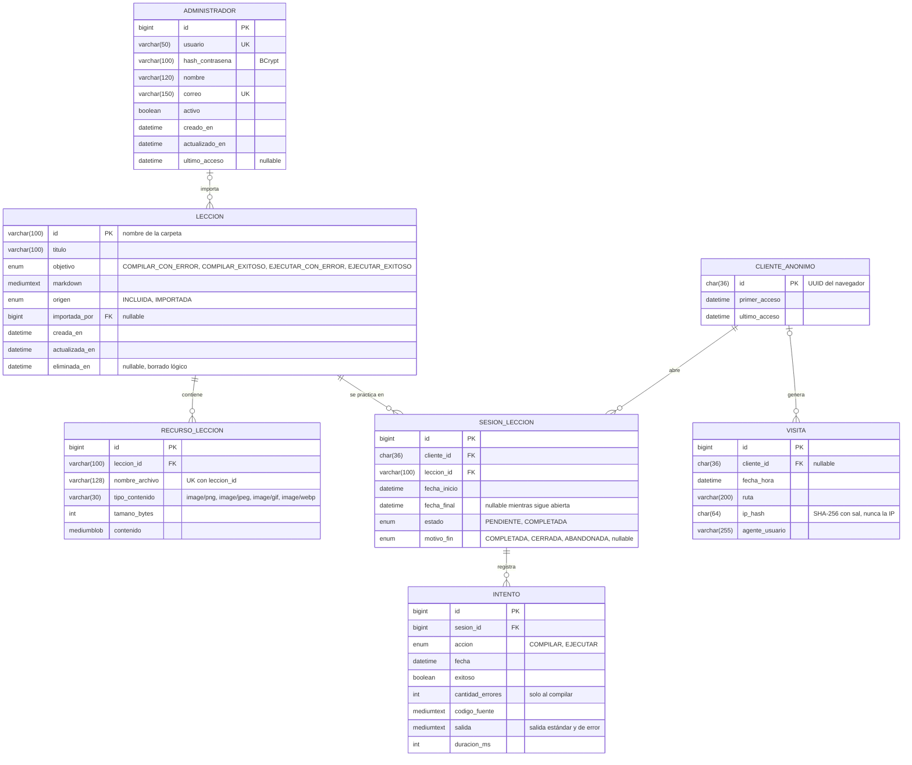

# Diagrama entidad-relación — modelo objetivo (fase 2)

La fase 1 no tiene base de datos: las lecciones viven en memoria (`InMemoryLeccionRepository`). Este es el modelo que tendrá MariaDB en la fase 2. Cubre lecciones e imágenes, el historial de sesiones con sus intentos de compilar y ejecutar, los administradores y las visitas para las estadísticas.

## Diccionario de datos

### ADMINISTRADOR
Usuarios que inician sesión para importar, exportar y eliminar lecciones, gestionar otros administradores y ver estadísticas (requisito de la fase 2).

- `usuario` y `correo` son únicos.
- `hash_contrasena` guarda el hash BCrypt de Spring Security, nunca la contraseña.
- `activo` permite desactivar una cuenta sin borrarla, para no romper la referencia `LECCION.importada_por`.

### LECCION
Equivale al `Leccion` del modelo de la fase 1. El `id` sigue siendo el nombre de la carpeta, así las URLs `/api/lecciones/{id}` no cambian.

- `objetivo` se guarda como el nombre del enum `Objetivo`.
- `markdown` guarda el texto original; el HTML se genera al consultar, igual que en la fase 1 (ver [ADR-002](decisiones.md#adr-002-repositorio-de-lecciones-en-memoria-detrás-de-una-interfaz)).
- `origen` distingue las lecciones que vienen con la aplicación de las importadas en un zip.
- **Borrado lógico** con `eliminada_en`: "Eliminar una lección" la oculta de la lista, pero el historial sigue mostrando su nombre.

### RECURSO_LECCION
Imágenes de la lección. Única por (`leccion_id`, `nombre_archivo`), que es exactamente como las busca `GET /api/lecciones/{id}/recursos/{archivo}`. Se guardan en la base (máximo 5 MB cada una) para que exportar a zip sea una sola consulta y no haga falta almacenamiento de archivos aparte.

### CLIENTE_ANONIMO
El estudiante no se autentica, pero el historial debe sobrevivir entre ejecuciones. El navegador recibe un UUID aleatorio la primera vez (cookie propia o `localStorage`) y lo envía en cada petición. No contiene datos personales. También permite contar visitantes únicos en las estadísticas.

### SESION_LECCION
Una fila por cada vez que se abre una lección: es una fila del panel **Historial de Sesión**.

| Columna del panel | Origen |
|---|---|
| Lección | `LECCION.titulo` (por `leccion_id`) |
| Fecha Inicio | `fecha_inicio`, cuando se abre la lección |
| Fecha Final | `fecha_final`: al completar el objetivo, al cerrar la lección o al abrir otra (abandono) |
| Estado | `estado`: `COMPLETADA` si algún intento cumplió el objetivo; si no, `PENDIENTE` |

`motivo_fin` registra por qué terminó la sesión.

### INTENTO
Cada vez que el estudiante presiona Compilar o Ejecutar. El enunciado pide que el historial registre todos los intentos, no solo el exitoso. A partir de los intentos se decide si la sesión cumplió su objetivo:

| Objetivo de la lección | Se completa cuando hay un intento… |
|---|---|
| `COMPILAR_CON_ERROR` | `accion = COMPILAR` y `exitoso = false` (`cantidad_errores > 0`) |
| `COMPILAR_EXITOSO` | `accion = COMPILAR` y `exitoso = true` |
| `EJECUTAR_CON_ERROR` | `accion = EJECUTAR` y `exitoso = false` |
| `EJECUTAR_EXITOSO` | `accion = EJECUTAR` y `exitoso = true` |

### VISITA
Fuente del módulo de estadísticas ("cuántos usuarios visitan la página en un intervalo de tiempo"). Visitantes únicos en un intervalo: `COUNT(DISTINCT cliente_id)` filtrando por `fecha_hora`. La IP se guarda solo como hash con sal, por privacidad.

## Índices previstos

| Tabla | Índice | Para qué |
|---|---|---|
| `RECURSO_LECCION` | único (`leccion_id`, `nombre_archivo`) | Buscar una imagen y evitar duplicados |
| `SESION_LECCION` | (`cliente_id`, `fecha_inicio` DESC) | Mostrar el historial del navegador, lo más reciente primero |
| `INTENTO` | (`sesion_id`, `fecha`) | Evaluar el objetivo de la sesión |
| `VISITA` | (`fecha_hora`) | Estadísticas por intervalo |
| `ADMINISTRADOR` | únicos `usuario` y `correo` | Inicio de sesión |

## Separación por microservicio (fase 2)

Cada servicio es dueño de sus tablas. Ningún servicio consulta las tablas de otro; se comunican por su API.

| Servicio | Tablas |
|---|---|
| `lecciones-service` | `LECCION`, `RECURSO_LECCION` |
| `historial-service` | `CLIENTE_ANONIMO`, `SESION_LECCION`, `INTENTO` |
| `admin-service` | `ADMINISTRADOR`, `VISITA` |

Por eso las referencias que cruzan servicios (por ejemplo `SESION_LECCION.leccion_id` o `LECCION.importada_por`) son **lógicas**: se validan por API y no como llave foránea de MariaDB cuando cada servicio tenga su propio esquema. El diagrama las muestra como relaciones porque describen el modelo de negocio completo.
