<div class="caratula">

<p class="caratula__institucion">UNIVERSIDAD MARIANO GÁLVEZ DE GUATEMALA<br>Facultad de Ingeniería</p>

<p class="caratula__curso">Desarrollo Web<br>Ing. MGSI. César Hernández</p>

<p class="caratula__titulo">Proyecto de curso — Fase 1</p>
<p class="caratula__subtitulo">Práctica de Java a mano<br>Documentación técnica</p>

<table class="caratula__campos">
<tr><td>Nombre:</td><td class="linea">&nbsp;</td></tr>
<tr><td>Carné:</td><td class="linea">&nbsp;</td></tr>
<tr><td>URL del proyecto desplegado:</td><td class="linea">&nbsp;</td></tr>
</table>

<p class="caratula__fecha">Guatemala, 3 de octubre de 2026</p>

</div>

<div class="salto"></div>

## Contenido

1. Introducción
2. Alcance de la fase 1
3. Requerimientos cubiertos
4. Interfaz
5. Arquitectura
6. Diagrama de despliegue
7. Diagrama entidad-relación
8. Decisiones de requerimientos funcionales y no funcionales
9. API REST
10. Pruebas y verificación
11. Despliegue y operación
12. Cómo ejecutar el proyecto
13. Anexo: estructura del proyecto

<div class="salto"></div>

## 1. Introducción

En los primeros cursos de programación, delegar en herramientas de inteligencia artificial impide desarrollar la memoria de la sintaxis y la capacidad de leer los errores del compilador. Esta aplicación web ofrece lecciones cortas en las que el estudiante **copia o edita a mano** un programa en Java, sin autocompletado ni asistentes, y enfrenta los errores de compilación y de ejecución como parte del aprendizaje.

El estudiante entra desde una computadora, una tablet o un teléfono, sin iniciar sesión. Cada lección tiene una explicación, un código modelo y un **objetivo**: compilar sin errores, provocar un error de compilación, ejecutar sin errores o provocar un error de ejecución.

El proyecto se entrega en dos fases. Este documento describe la fase 1 y la arquitectura objetivo de la fase 2.

## 2. Alcance de la fase 1

| Incluido en la fase 1 | Para la fase 2 |
|---|---|
| Interfaz gráfica general según los mocks | Compilar y Ejecutar con `guali-dev.jar` |
| Lecciones › Abrir lección (carga una de las disponibles) y Cerrar lección | Panel Historial de Sesión, persistente |
| Configuración: tamaño de letra y tema claro/oscuro, guardados solo en memoria | Persistencia en MariaDB con JPA |
| Configuración: importar lecciones (zip), exportarlas y eliminar una, en memoria | Autenticación de administradores para esas opciones |
| Ayuda | Seguridad: WAF, anti-DoS, CDN seguro, reverse proxy, autenticación de administradores |
| Despliegue en la nube con URL pública | Administración: CRUD de administradores y estadísticas de visitas |

Compilar, Ejecutar e Historial están visibles pero sin acción, con el aviso "Disponible en fase 2".

## 3. Requerimientos cubiertos

| Requerimiento del enunciado | Implementación |
|---|---|
| Barra de menú con Lecciones, Configuración, Historial y Ayuda | Menús desplegables usables con mouse, teclado y pantalla táctil |
| Título de lección activa | Barra "Lección activa" con el nombre de la lección y su objetivo |
| Panel de lección activa | Markdown renderizado en el servidor, con imágenes, código numerado y tablas; scroll propio |
| Editor de código | `<textarea>` con fuente monoespaciada legible, sin autocompletado ni corrector; Tab inserta 4 espacios; números de línea |
| Botones Compilar y Ejecutar debajo del editor | Visibles, con aviso "Disponible en fase 2" |
| Panel de consola | Mensajes del sistema; estilos listos para éxito, error de compilación y error de ejecución |
| Abrir lección | Diálogo con las lecciones disponibles y el objetivo de cada una |
| Cerrar lección | Limpia panel, editor y título; pide confirmación si el editor tiene código |
| Aumentar o disminuir el tamaño de la fuente | A− / A+ de 12 a 24 px; afecta todo el texto |
| Tema claro y oscuro | Tema "cuaderno" (claro) y "pizarra" (oscuro), con contraste WCAG AA |
| Configuración solo en memoria | Variables de JavaScript; sin `localStorage`, `sessionStorage` ni cookies |
| Importar un compendio (zip) | Configuración › Administración: valida cada lección, informa las omitidas y su motivo; protegido contra zip slip y zip bombs |
| Eliminar una lección | Diálogo con la lista de lecciones y confirmación |
| Exportar lecciones | Descarga `lecciones.zip` con el mismo formato que se importa |
| Ayuda a criterio | Diálogo con pasos de uso, tipos de objetivo, ejemplos de mensajes y atajos |
| Estructura de lección (`leccion.md`, `config.txt`, imágenes) | Carga desde el classpath con validación; 4 lecciones de ejemplo, una por objetivo |
| Arquitectura cloud-native, MVC, REST | Servicio Spring Boot con capas MVC y API REST, en contenedor Docker con health check |
| URL del proyecto desplegado | Render (ver sección 11) |

## 4. Interfaz

La distribución respeta los mocks del enunciado: menú arriba, barra de lección activa, lección a la izquierda, editor a la derecha, botones debajo del editor y consola abajo. En pantallas de menos de 900 px los paneles se apilan en ese mismo orden.

El diseño parte de las dos superficies donde se aprende a escribir en el aula:

- **Cuaderno (tema claro):** hoja con renglones, margen y tinta azul.
- **Pizarra (tema oscuro):** fondo verde gris y letra de tiza.

El editor es la "plana": cada línea de código cae sobre un renglón, con su número en el margen y la línea actual resaltada. Así es fácil encontrar la línea que menciona el compilador. La tipografía es Atkinson Hyperlegible Mono, diseñada para distinguir caracteres parecidos (0 y O; 1, l e I), y se empaqueta con la aplicación para que funcione sin internet.

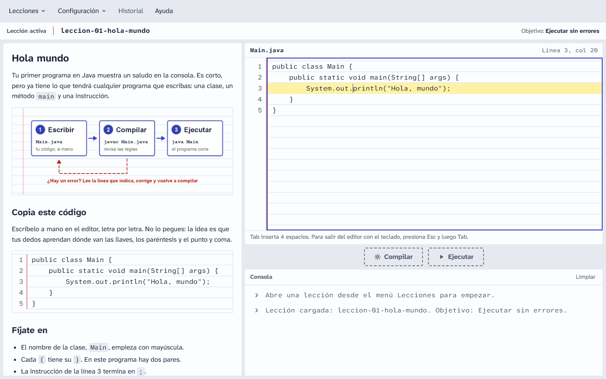

*Figura 1. Escritorio, tema claro: lección 1 abierta y código escrito en el editor.*

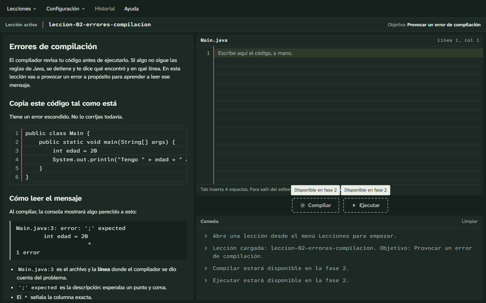

*Figura 2. Escritorio, tema oscuro: lección 2 y avisos "Disponible en fase 2".*

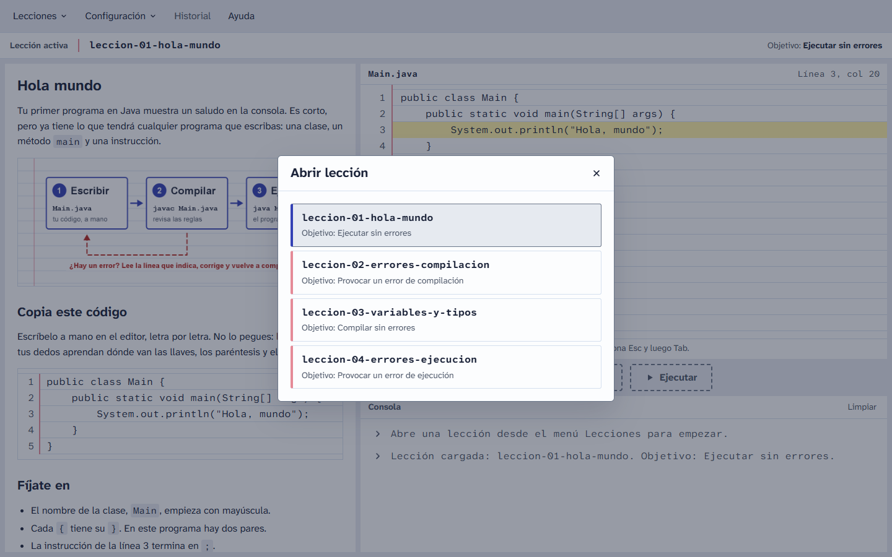

*Figura 3. Abrir lección: lista de lecciones con su objetivo.*

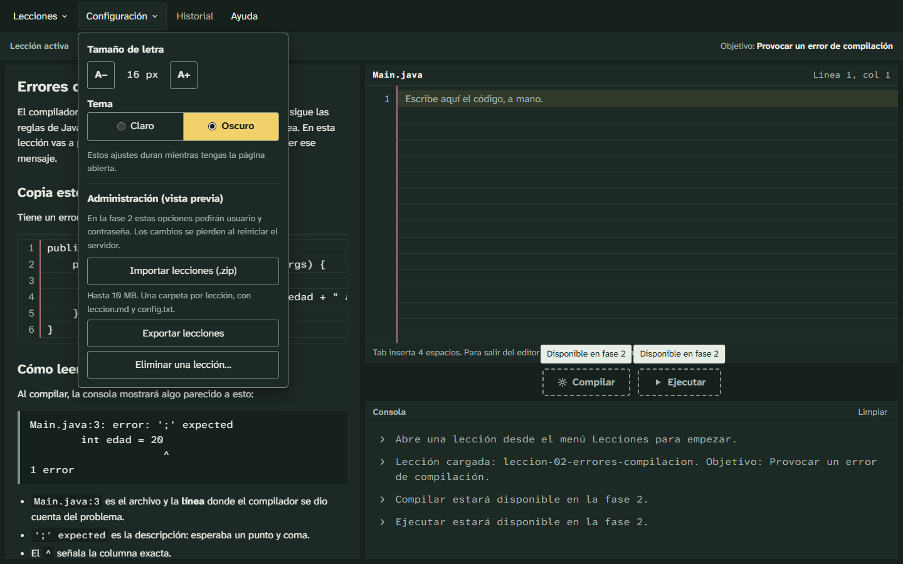

*Figura 4. Configuración: tamaño de letra, tema y administración (importar, exportar y eliminar lecciones).*

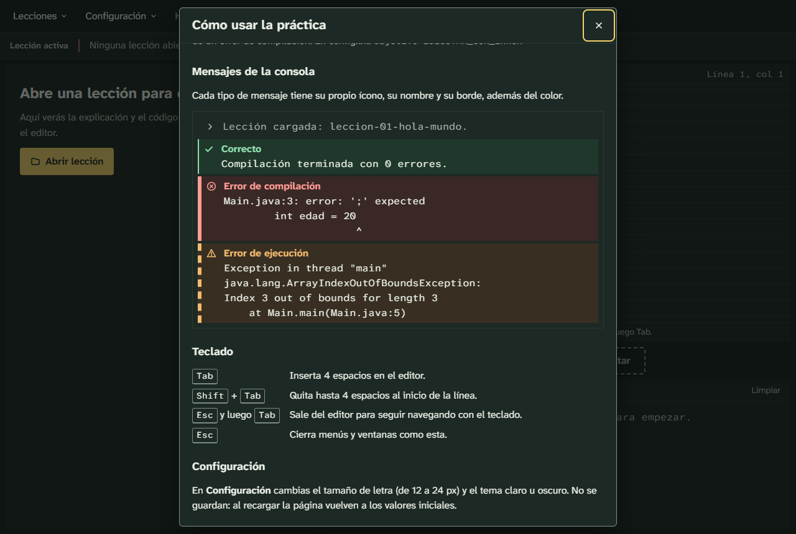

*Figura 5. Ayuda: los tres estados de la consola que usará la fase 2 se distinguen por ícono, nombre y tipo de borde, no solo por color.*

<div class="figuras-moviles" markdown="1">

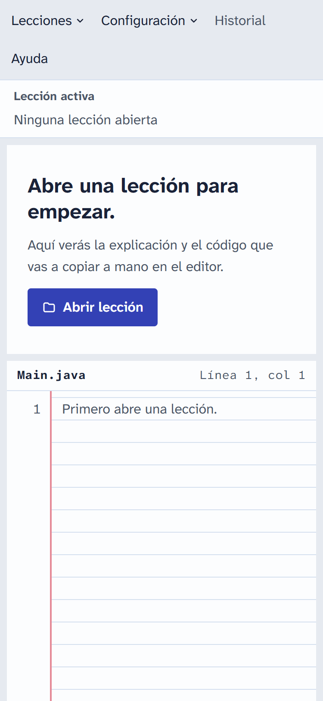
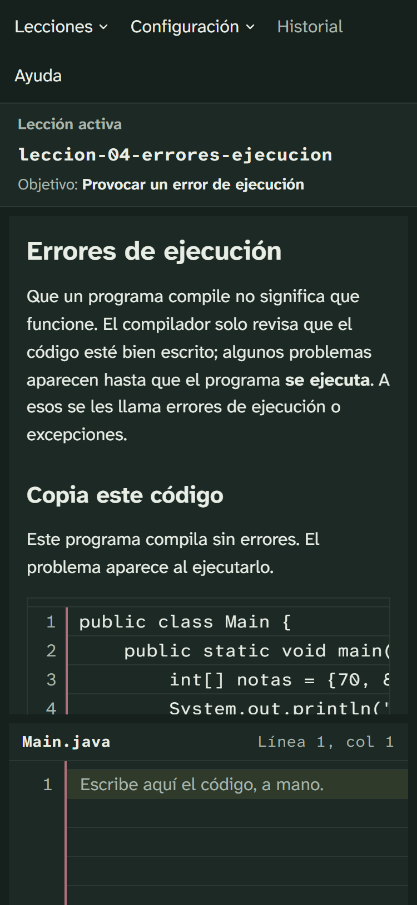

</div>

*Figura 6. Teléfono (375 px): estado vacío en tema claro y lección abierta en tema oscuro.*

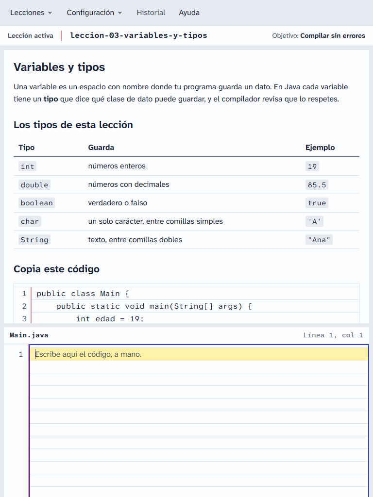

*Figura 7. Tablet (768 px), tema claro.*

## 5. Arquitectura

La fase 1 es un solo servicio, `lecciones-service`, que expone la API REST y sirve el frontend estático. Por dentro está organizado como **monolito modular** listo para separarse en microservicios en la fase 2:

- Un paquete por módulo de negocio. Hoy existen `leccion/` y `admin/` (importar, exportar y eliminar); en la fase 2 se suman `historial/` y `ejecucion/`.
- Dentro de cada módulo, el patrón MVC por capas: `controller → service → repository → model/dto`.
- El repositorio está detrás de la interfaz `LeccionRepository`. Hoy la implementa `InMemoryLeccionRepository` (`ConcurrentHashMap`); en la fase 2 la implementará JPA sin cambiar controllers ni services.
- El frontend (HTML, CSS y JavaScript con módulos ES, sin frameworks) llama rutas `/api/<módulo>/**`, las mismas que expondrá el API Gateway de la fase 2.

**Flujo de una lección**

1. Al arrancar, `CargadorLecciones` lee cada carpeta de `lecciones/` del classpath.
2. `ValidadorLeccion` revisa el nombre, `leccion.md`, `config.txt` y las imágenes. Una lección inválida se registra en el log y se omite, sin detener el servicio.
3. `GET /api/lecciones/{id}` renderiza el markdown con commonmark-java, escapa el HTML crudo y reescribe las imágenes relativas hacia `/api/lecciones/{id}/recursos/{archivo}`.
4. El navegador muestra el HTML, numera los bloques de código Java y habilita el editor.

## 6. Diagrama de despliegue

### Fase 1 (actual)

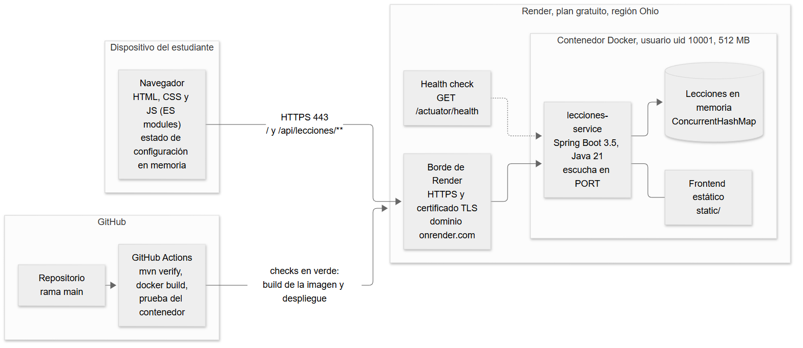

*Figura 8. Despliegue de la fase 1 en Render.*

El navegador se conecta por HTTPS al borde de Render, que termina TLS y reenvía al contenedor Docker. El contenedor corre el jar de Spring Boot sobre Java 21 con un usuario sin privilegios y escucha en el puerto que define la variable `PORT`. Render revisa `/actuator/health` antes de enviar tráfico a una versión nueva. GitHub Actions compila, prueba y construye la imagen en cada push; Render despliega solo los commits que pasan.

### Fase 2 (objetivo)

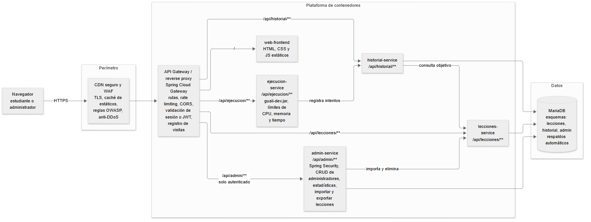

*Figura 9. Arquitectura objetivo de la fase 2.*

| Componente | Responsabilidad |
|---|---|
| CDN seguro + WAF | TLS, caché de estáticos, reglas contra ataques comunes y mitigación de denegación de servicio |
| API Gateway / reverse proxy | Punto único de entrada: enrutamiento por prefijo, límite de peticiones, validación de la sesión de administrador, registro de visitas |
| `lecciones-service` | Lecciones e imágenes (el servicio de la fase 1, con JPA) |
| `historial-service` | Sesiones de lección e intentos; decide si se cumplió el objetivo |
| `ejecucion-service` | Compila y ejecuta con `guali-dev.jar`, aislado y con límites de CPU, memoria y tiempo |
| `admin-service` | Spring Security, CRUD de administradores, importar, exportar y eliminar lecciones, estadísticas |
| MariaDB | Persistencia, un esquema por servicio |

## 7. Diagrama entidad-relación

El ER describe el modelo de la fase 2. La fase 1 no tiene base de datos.

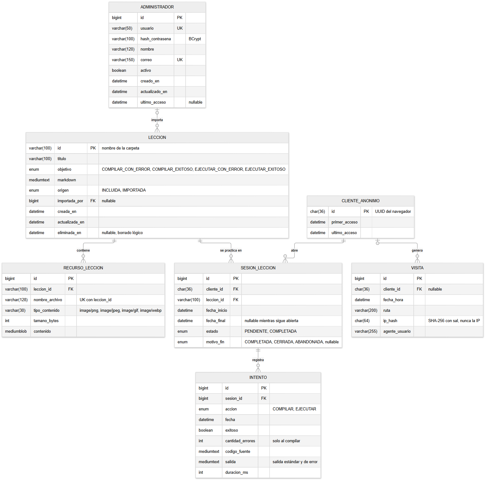

*Figura 10. Modelo de datos objetivo (MariaDB).*

| Entidad | Contenido |
|---|---|
| `LECCION` | Id (nombre de la carpeta), título, objetivo, markdown, origen (incluida o importada), administrador que la importó, borrado lógico |
| `RECURSO_LECCION` | Imágenes de cada lección, únicas por lección y nombre de archivo |
| `CLIENTE_ANONIMO` | UUID aleatorio del navegador; permite un historial persistente sin pedir inicio de sesión al estudiante |
| `SESION_LECCION` | Una fila del Historial de Sesión: lección, fecha de inicio, fecha final y estado (Completada o Pendiente) |
| `INTENTO` | Cada vez que se presiona Compilar o Ejecutar: resultado, cantidad de errores, código y salida |
| `ADMINISTRADOR` | Usuarios con acceso a la administración; la contraseña se guarda como hash BCrypt |
| `VISITA` | Visitas por fecha para las estadísticas; la IP se guarda solo como hash |

Una sesión se marca **Completada** cuando alguno de sus intentos cumple el objetivo de la lección. Por ejemplo, para `EJECUTAR_CON_ERROR` hace falta un intento de ejecutar que haya terminado con error.

## 8. Decisiones de requerimientos funcionales y no funcionales

### 8.1 Decisiones de arquitectura

**ADR-001. Monolito modular en la fase 1, microservicios en la fase 2.**
*Contexto:* el enunciado pide microservicios, pero la fase 1 tiene un solo dominio y debe desplegarse en pocos días.
*Decisión:* un servicio con un paquete por módulo y capas MVC; los módulos solo se comunican por sus servicios.
*Alternativas:* microservicios desde ya (gateway y varios servicios para un solo caso de uso, más costo y arranques en frío) o un monolito sin módulos (más difícil de separar después).
*Consecuencia:* despliegue y depuración simples. La separación queda preparada por paquetes y prefijos de URL.

**ADR-002. Repositorio en memoria detrás de una interfaz.**
*Contexto:* la fase 1 excluye la base de datos; la fase 2 usa MariaDB con JPA.
*Decisión:* `LeccionRepository` con los mismos métodos que Spring Data y una implementación con `ConcurrentHashMap`.
*Alternativas:* H2 con JPA (adelanta una tecnología excluida de la fase 1) o leer los archivos en cada petición (más E/S y nada que reemplazar por JPA).
*Consecuencia:* el cambio a JPA no toca controllers ni services. Lo importado en memoria se pierde al reiniciar, lo cual se acepta en la fase 1.

**ADR-003. Markdown renderizado en el servidor con HTML escapado.**
*Contexto:* en la fase 2 se importarán lecciones de terceros; un markdown puede traer `<script>` o enlaces `javascript:`.
*Decisión:* commonmark-java con `escapeHtml`, `sanitizeUrls` y reescritura de imágenes; además, una Content-Security-Policy que solo permite recursos del propio servidor.
*Alternativas:* marked + DOMPurify en el navegador (dos librerías en el cliente) o flexmark (más pesada).
*Consecuencia:* un único punto de sanitización, con pruebas. Las lecciones no pueden incluir HTML propio.

**ADR-004. Imágenes servidas desde memoria con lista blanca.**
*Contexto:* una ruta con nombre de archivo es el caso clásico de path traversal.
*Decisión:* las imágenes se buscan en un mapa en memoria y nunca se arma una ruta del disco con datos del usuario. Solo se aceptan png, jpg, jpeg, gif y webp (no svg), con nombre validado y firma de bytes verificada.
*Consecuencia:* `config.txt` y `leccion.md` no se pueden descargar. Las pruebas cubren rutas como `..%2F` y `..%5C`.

**ADR-005. Frontend sin frameworks ni build.**
*Contexto:* una sola pantalla, uso sin internet, despliegue junto al servicio.
*Decisión:* HTML5, CSS con variables y JavaScript con módulos ES; `<dialog>` nativo; fuentes empaquetadas.
*Alternativas:* React o Vue con Vite (dependencias y un paso de build más) o Thymeleaf (menos adecuado para el editor interactivo).
*Consecuencia:* se lee y modifica sin herramientas. El frontend se verifica con una lista manual y capturas.

**ADR-006. Configuración solo en memoria.**
*Decisión:* el tamaño de letra y el tema viven en variables de JavaScript; al recargar vuelven a 16 px y al tema del sistema operativo.
*Consecuencia:* cumple el enunciado y no necesita aviso de cookies; el estudiante vuelve a elegir en cada visita.

**ADR-007. Editor sin ayudas.**
*Contexto:* el objetivo pedagógico es escribir y enfrentar los errores propios.
*Decisión:* `<textarea>` sin autocompletado, corrector, cierre de llaves ni resaltado de sintaxis. Solo agrega Tab = 4 espacios, números de línea y renglón actual; Esc y Tab salen del editor para no atrapar el foco del teclado.
*Alternativas:* CodeMirror o Monaco, que traen justo las ayudas que se quieren evitar.

**ADR-009. Importar, exportar y eliminar activos en la fase 1, sin autenticación.**
*Contexto:* el enunciado pide que las opciones de Configuración funcionen en memoria en la fase 1, pero excluye la seguridad.
*Decisión:* funcionan bajo `/api/admin/**` y se pueden apagar con `APP_ADMIN_PREVIEW_ENABLED`. Para que nadie pueda tumbar el servicio hay límites: zip de 10 MB, 500 entradas, 50 MB descomprimidos, 5 MB por archivo, 100 lecciones y 64 MB en memoria. Las rutas que intentan salir de su carpeta rechazan el zip completo.
*Consecuencia:* el catedrático puede probarlas en la URL pública; los cambios se pierden al reiniciar. En la fase 2 se agrega Spring Security sobre `/api/admin/**`.

**ADR-008. Render con Docker.**
*Contexto:* URL pública, presupuesto cero, despliegue desde GitHub.
*Decisión:* blueprint `render.yaml`, imagen multi-stage con usuario sin privilegios, health check y despliegue solo cuando pasa el CI.
*Alternativas:* Railway (sin plan gratuito permanente) y Azure Container Apps (más pasos y consume crédito).
*Consecuencia:* configuración reproducible desde el repositorio. El plan gratuito se duerme tras 15 minutos sin tráfico; la primera visita tarda alrededor de un minuto.

### 8.2 Decisiones funcionales

| Decisión | Justificación |
|---|---|
| La consola va en la columna derecha, debajo de los botones | Así aparece en el mock de la interfaz principal; en móvil queda al final. |
| La barra de lección activa muestra también el objetivo | El estudiante sabe qué resultado debe conseguir sin abrir la Ayuda. |
| Cerrar lección, o abrir otra, pide confirmación solo si el editor tiene código | Evita perder lo escrito sin molestar cuando no hay nada que perder; la opción enfocada es "Seguir escribiendo". |
| El editor empieza vacío y en solo lectura hasta abrir una lección | La práctica es escribir a mano; el estado vacío invita a abrir una lección. |
| Compilar, Ejecutar e Historial usan `aria-disabled` | Siguen siendo enfocables: el aviso se ve con mouse, teclado y toque, y la consola explica por qué no responden. |
| La consola ya distingue éxito, error de compilación y error de ejecución | Ícono, nombre y borde distintos; la fase 2 solo conecta los resultados. |
| Los bloques de código de la lección se numeran como el editor | El estudiante copia línea por línea con la misma numeración que usará el compilador. |
| En pantallas táctiles, al abrir una lección no se enfoca el editor | Evita que el teclado virtual tape la lección antes de leerla. |

### 8.3 Decisiones no funcionales

| Área | Decisión |
|---|---|
| Seguridad | CSP `default-src 'self'`, `nosniff`, `X-Frame-Options: DENY`; Actuator expone solo `health`; errores JSON sin trazas; importar, exportar y eliminar bajo `/api/admin/**` con límites de tamaño y memoria, listos para Spring Security. |
| Accesibilidad | Contraste WCAG AA verificado en ambos temas, foco visible, diálogos que cierran con Esc, áreas táctiles de 44 px, etiquetas ARIA y respeto de `prefers-reduced-motion`. |
| Uso sin internet | Sin CDNs: fuentes, íconos y scripts se sirven desde la aplicación. |
| Rendimiento | Lecciones en memoria, compresión HTTP y caché de imágenes. El servicio arranca en unos 2 segundos en local. |
| Operación | Health check para la nube; logs que explican por qué se omite una lección; contenedor sin root ajustado a 512 MB. |
| Calidad | Integración continua con pruebas e imagen Docker en cada push. |

## 9. API REST

| Método | Ruta | Respuesta |
|---|---|---|
| GET | `/api/lecciones` | Lista `[{id, titulo, objetivo}]` |
| GET | `/api/lecciones/{id}` | `{id, titulo, objetivo, html}` |
| GET | `/api/lecciones/{id}/recursos/{archivo}` | Imagen de la lección |
| GET | `/actuator/health` | `{"status":"UP"}` |
| POST | `/api/admin/lecciones/importar` | Zip (multipart `archivo`) → `{importadas, omitidas, avisos}` |
| DELETE | `/api/admin/lecciones/{id}` | `204`, o `404` si no existe |
| GET | `/api/admin/lecciones/exportar` | `lecciones.zip` |

Todos los errores responden con el mismo formato:

```
{ "timestamp": "2026-10-03T17:00:00Z", "estado": 404, "error": "Not Found",
  "mensaje": "No existe la lección leccion-99", "ruta": "/api/lecciones/leccion-99" }
```

## 10. Pruebas y verificación

| Tipo | Qué cubre |
|---|---|
| Unitarias | Parser de `config.txt` (formatos válidos, BOM, CRLF, valores inválidos), validación de lecciones, renderizado seguro del markdown y reescritura de imágenes, path traversal |
| Integración | Carga de las lecciones del classpath, incluidas lecciones inválidas que se omiten |
| API (`@WebMvcTest`) | Lista, detalle, imágenes, errores 400/404/405 con JSON y cabeceras de seguridad |
| Importar y exportar | Zip slip, zip bombs (también en entradas ignoradas), límites de entradas y de tamaño, `__MACOSX` y ocultos, con y sin carpeta raíz, lecciones inválidas omitidas, topes de memoria, exportar → importar |
| Humo (`@SpringBootTest`) | La aplicación completa en un puerto real: health, 4 lecciones, frontend y rutas codificadas rechazadas por el servidor |
| Manual | Flujos de la interfaz en escritorio, tablet y móvil, en ambos temas (capturas de la sección 4) |
| Despliegue | `scripts/verificar-despliegue.sh <URL>`: 18 comprobaciones contra la URL pública |

Resultado: **118 pruebas automáticas en verde** con `mvnw verify`.

## 11. Despliegue y operación

- **Plataforma:** Render, plan gratuito, servicio web Docker definido en `render.yaml`.
- **URL pública:** la anotada en la carátula.
- **Integración continua:** GitHub Actions ejecuta `mvnw verify`, construye la imagen Docker, la ejecuta y comprueba `/actuator/health`. Render despliega solo si estas verificaciones pasan.
- **Variables:** `PORT` (la define Render) y `APP_ADMIN_PREVIEW_ENABLED=true` (importar, exportar y eliminar; con `false` se ocultan).
- **Rollback:** desde el panel de Render se vuelve al despliegue anterior. Al no haber base de datos, es inmediato.
- **Arranque en frío:** el plan gratuito apaga el servicio tras 15 minutos sin visitas; la primera visita tarda alrededor de un minuto.

Los pasos detallados están en `DEPLOY.md` y la lista de verificación en `docs/checklist-despliegue.md`.

## 12. Cómo ejecutar el proyecto

Con Java 21 instalado:

```
cd lecciones-service
./mvnw spring-boot:run          (Windows: mvnw.cmd spring-boot:run)
```

Abrir `http://localhost:8080`. Si el puerto está ocupado, se define otro con la variable `PORT`.

Con Docker:

```
docker build -t lecciones-service lecciones-service
docker run --rm -p 8080:8080 lecciones-service
```

## 13. Anexo: estructura del proyecto

```
├─ lecciones-service/                 servicio de la fase 1
│  ├─ Dockerfile
│  └─ src/main/
│     ├─ java/gt/edu/umg/lecciones/
│     │  ├─ leccion/                  controller, service, repository, model, dto, carga
│     │  └─ comun/                    errores centralizados y cabeceras de seguridad
│     └─ resources/
│        ├─ lecciones/                4 lecciones de ejemplo
│        └─ static/                   index.html, css/, js/, fonts/
├─ docs/                              decisiones, diagramas, plan de pruebas y este documento
├─ scripts/                           empaquetado, verificación del despliegue e imagen de la lección 1
├─ render.yaml                        blueprint de Render
└─ .github/workflows/ci.yml           integración continua
```
