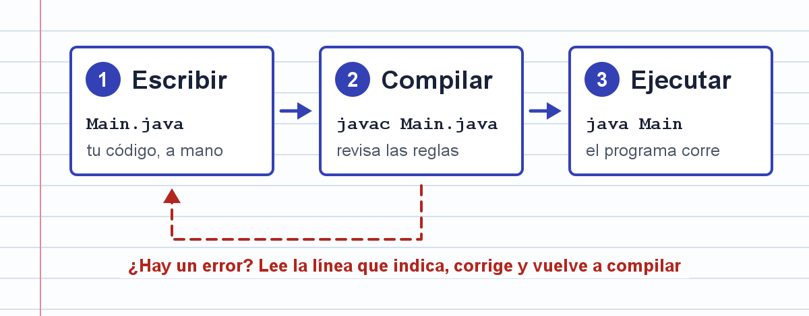

# Hola mundo

Tu primer programa en Java muestra un saludo en la consola. Es corto, pero ya tiene lo que tendrá cualquier programa que escribas: una clase, un método `main` y una instrucción.



## Copia este código

Escríbelo a mano en el editor, letra por letra. No lo pegues: la idea es que tus dedos aprendan dónde van las llaves, los paréntesis y el punto y coma.

```java
public class Main {
    public static void main(String[] args) {
        System.out.println("Hola, mundo");
    }
}
```

## Fíjate en

- El nombre de la clase, `Main`, empieza con mayúscula.
- Cada `{` tiene su `}`. En este programa hay dos pares.
- La instrucción de la línea 3 termina en `;`.
- Java distingue mayúsculas de minúsculas: `System` no es lo mismo que `system`.
- El texto entre comillas se muestra tal cual. Puedes cambiar el saludo.

## Objetivo

Compila y ejecuta el programa sin errores. En la consola debe aparecer:

```
Hola, mundo
```
